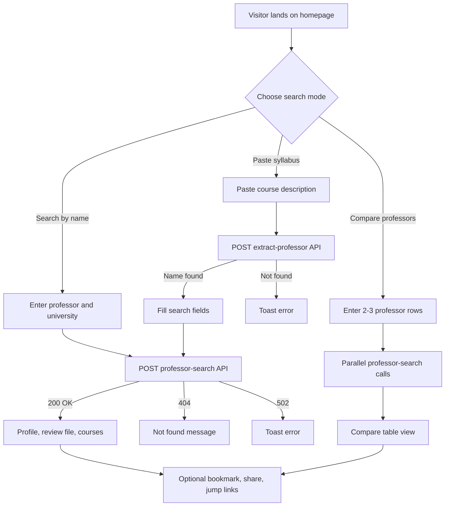
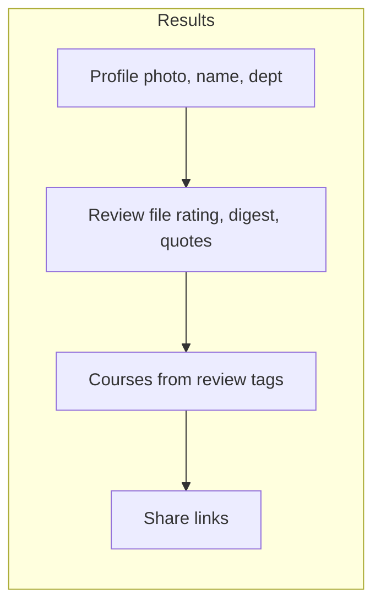
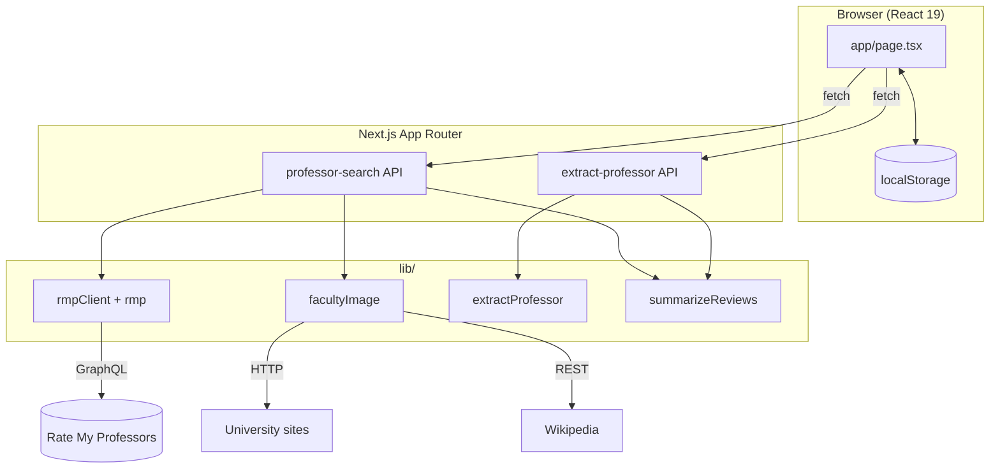
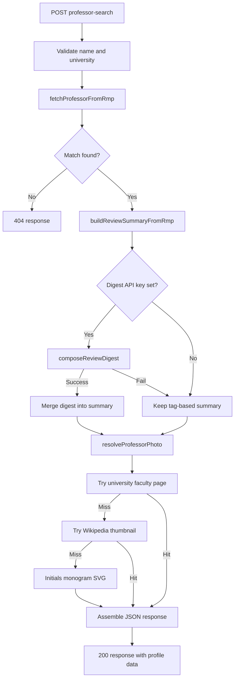
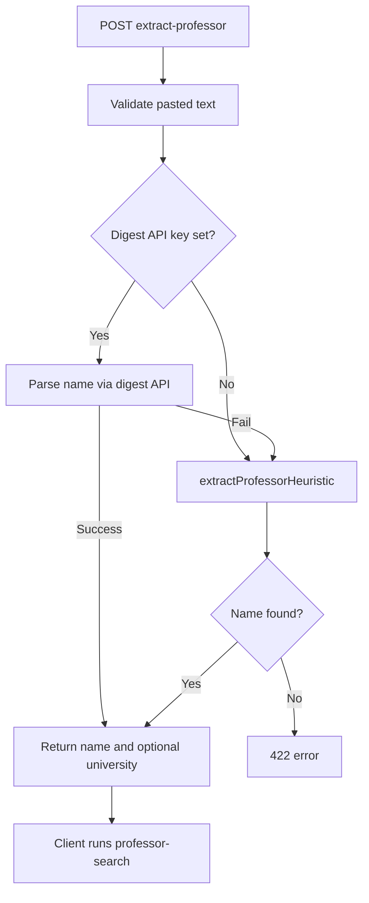
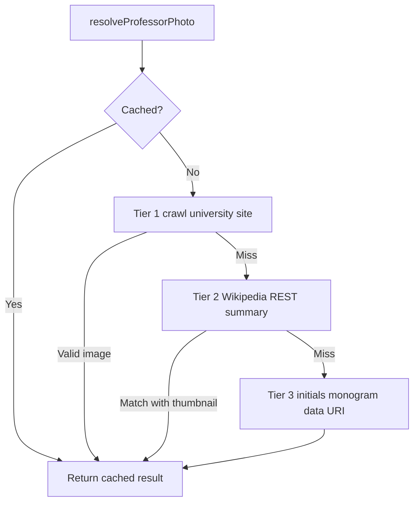
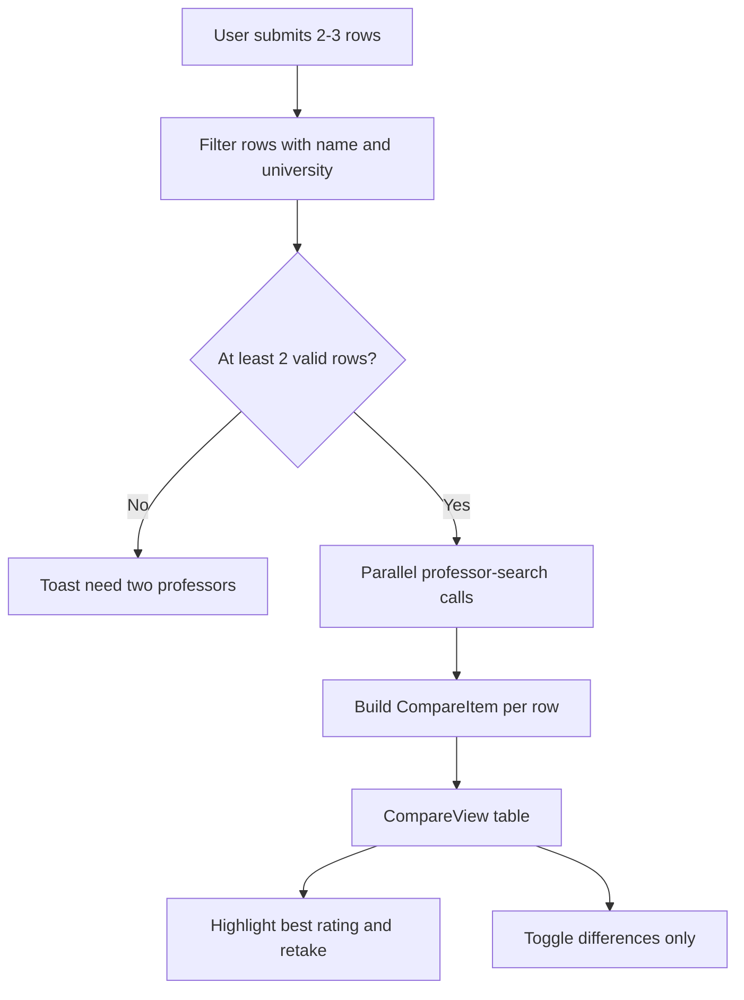

# The Faculty Ledger

**Independent desk for course research.**

The Faculty Ledger helps students look up professors, compare sections, and read [Rate My Professors](https://www.ratemyprofessors.com) data in a clean editorial layout. Search by name, paste a syllabus to find the instructor, or run a side-by-side comparison before registration.

> Not affiliated with Rate My Professors.

---

## Features

| Feature | Description |
|---|---|
| **Name search** | Look up a professor by name and university |
| **Syllabus paste** | Drop course text; the app finds the instructor and runs a lookup |
| **Compare** | Put up to three professors in one table with differences highlighted |
| **Review file** | Rating, histogram, pros/cons, and verbatim quotes from RMP |
| **Faculty photos** | University page, Wikipedia, or initials monogram fallback |
| **Reading list** | Save professors to favorites (stored in the browser) |
| **Share links** | URL with `?name=` and `?university=` query params |
| **Day edition** | Light mode by default; switch to night edition in the header |

---

## User flows

### Main search paths



### Results page layout



---

## Architecture

### System overview



### Professor search pipeline



### Syllabus extraction



### Faculty photo resolution



### Compare mode



---

## Project structure

```
app/
  page.tsx                 # Main UI and search orchestration
  layout.tsx               # Fonts, metadata, theme init script
  icon.tsx / apple-icon.tsx
  opengraph-image.tsx
  robots.ts / sitemap.ts
  api/
    professor-search/      # RMP lookup + digest + photo
    extract-professor/     # Syllabus name parsing

components/
  SearchHero.tsx           # Three search modes
  ProfessorProfile.tsx     # Sidebar profile
  ReviewDashboard.tsx      # Ratings, digest, quotes
  CompareView.tsx          # Comparison table
  CourseTags.tsx           # Course list from reviews
  SocialShare.tsx          # Share link buttons
  SiteHeader.tsx           # Logo + theme toggle

lib/
  rmpClient.ts             # RMP GraphQL client
  rmp.ts                   # Search, summaries, distributions
  facultyImage.ts          # Tiered photo resolver
  extractProfessor.ts      # Regex syllabus parser
  summarizeReviews.ts      # Optional review digest API
  storage.ts               # localStorage helpers
  copy.ts                  # UI strings
  site.ts                  # Brand + SEO config
```

---

## Getting started

### Prerequisites

- Node.js 20+
- npm

### Install and run

```bash
git clone https://github.com/Konseptt/faculty-ledger.git
cd faculty-ledger
npm install
cp .env.example .env.local
npm run dev
```

Open [http://localhost:3000](http://localhost:3000).

### Environment variables

Copy `.env.example` to `.env.local`:

| Variable | Required | Description |
|---|---|---|
| `NEXT_PUBLIC_SITE_URL` | Production | Canonical URL for SEO, sitemap, and share links |
| `REVIEW_DIGEST_API_KEY` | Optional | Richer review digests and syllabus parsing. Without it, the app uses RMP tags and regex heuristics. |

Optional overrides for a compatible OpenAI-style chat completions API:

| Variable | Default | Description |
|---|---|---|
| `REVIEW_DIGEST_API_URL` | NVIDIA integrate endpoint | API base URL |
| `REVIEW_DIGEST_MODEL` | `meta/llama-4-maverick-17b-128e-instruct` | Model identifier |

---

## Scripts

| Command | Description |
|---|---|
| `npm run dev` | Start development server |
| `npm run build` | Production build |
| `npm run start` | Run production server |
| `npm test` | Run Vitest unit tests |
| `npm run lint` | ESLint |

---

## Deploy

Deploy to [Vercel](https://vercel.com) or any Node.js host that supports Next.js 16.

1. Set `NEXT_PUBLIC_SITE_URL` to your production domain.
2. Optionally set `REVIEW_DIGEST_API_KEY` in the host environment.
3. Run `npm run build` in CI or let the platform build on push.

Share links use query params:

```
https://your-domain.com/?name=Jane+Smith&university=Stanford+University
```

---

## Testing

```bash
npm test
```

Tests cover RMP client parsing, sentiment scoring, faculty image resolution, syllabus extraction, storage helpers, and compare view rendering.

---

## Data and attribution

- **Reviews and ratings** come from Rate My Professors via their public GraphQL API.
- **Photos** may come from public university faculty pages or Wikipedia when a confident match exists.
- **Review digests** (when enabled) are composed from real review text already on RMP. They do not invent ratings or reviews.

This project is an independent tool and is not endorsed by Rate My Professors.

---

## Tech stack

- [Next.js 16](https://nextjs.org) (App Router)
- [React 19](https://react.dev)
- [TypeScript](https://www.typescriptlang.org)
- [Tailwind CSS 4](https://tailwindcss.com)
- [Vitest](https://vitest.dev)

---

## License

Add a license before open-sourcing. Until then, all rights reserved.
